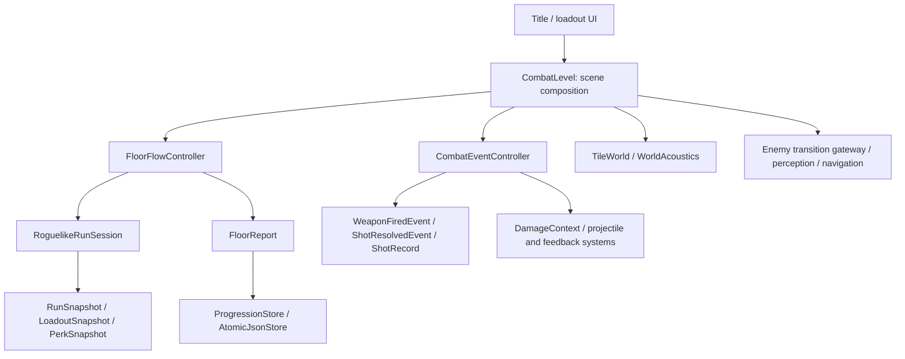

# Runtime architecture — 1.3.2

The runtime uses Godot scene ownership, typed controllers and values, and signal adapters. It does not replace the scene tree with a separate entity framework.

## Ownership and dependency direction

`CombatLevel` (`main.gd`) creates `FloorFlowController` and `CombatEventController` as child nodes before scene readiness. They have a typed `CombatLevel` reference and no independent lifetime. The level still owns shared scene services, world assembly helpers, UI, and legacy focus integration. Controllers call those explicit facade members; they are not advertised as fully independent domain services.

### FloorFlowController

Owns deployment flags and entry UI references, completion/exit flags, retry/new-run handling, room-completion presentation, scoring, floor reports, and transition rollback. Its startup path composes player/world services through the level. Its checkpoint path uses `RunSnapshot` directly.

Completion credits one floor once. Intermediate floors open a physical exit; only final victory ends the run. Departure captures resources again so scavenging after the final kill is carried onward. Failed transitions restore progression selection, clear the pending transition and release player controls. `transition_request` is an optional callable seam for controlled failure tests; production falls back to `SceneTransition.transition_to`.

### CombatEventController

Owns the typed trigger ledger and coordinates weapon-fire presentation, hit/death processing, melee/execution feedback and player death. Main's existing callbacks remain adapters so scene connections and subclass-based fixtures continue to work.

`WeaponFiredEvent` represents a trigger presentation event. `ShotResolvedEvent` converts legacy outcome strings into a typed enum. `ShotRecord` tracks expected/resolved pellets and hit/lethal/reporting state. Pool rejection is a terminal pellet outcome too. The existing `DamageContext` continues carrying physical impact data; damage and blood budget calculation are not reimplemented here.

## Snapshot and persistence boundaries

`RoguelikeRunSession` internally stores nullable `RunSnapshot` values for the entry checkpoint and outgoing transfer. Null means no checkpoint, rather than an arbitrary partially initialized dictionary.

- `RunSnapshot`: health, armor, blood, focus fields, typed cooldown values, loadout and perks.
- `LoadoutSnapshot`: typed weapon rows, attachment IDs, reserve ammunition and equipped/movement settings.
- `PerkSnapshot`: learned IDs and remaining trigger/timer state.
- `FloorReport`: authoritative room, combat and score-input report fields.

Copies detach nested inventory and perk collections. Returning a compatibility `floor_checkpoint` or `transfer_state` dictionary does not expose internal mutable storage. Existing `capture`, `restore`, `get_entry_state` and progression/save APIs remain dictionary adapters; production floor startup uses `capture_snapshot`, `restore_snapshot`, `get_entry_snapshot` and `remember_snapshot`.

JSON conversion accepts known field types, handles nonfinite numeric values and ignores malformed weapon rows. Run state remains memory-only. Permanent save schema versions and on-disk formats are unchanged. Catalogs, authoring data and unrelated legacy dictionaries are outside this conversion.

## Enemy state entry

`transition_to(next_state: State, cause: StringName)` is the only runtime writer of `_state`. Internal patrol, visual acquisition, attack, search, return, stagger and knockdown transitions call it explicitly. A legacy `state = ...` assignment invokes the same gateway with cause `external`.

The gateway rejects dead-actor transitions, makes same-state requests idempotent, updates the state presentation pulse, and emits `state_changed(previous, current, cause)`. `last_transition_cause` stores bounded diagnostic context. It does not retain an unbounded history.

Semantic entry methods such as `_begin_investigation` and `_begin_search` still prepare targets, search points and timers. The notification describes the state change; it is not a promise that every caller-specific payload has already been prepared. Room activation and perception remain responsible for admissible combat behavior. This refactor does not introduce a new behavior tree or change AI balance.

## Regression contracts

`test_architecture_contracts` covers nested copy isolation, JSON round trips, malformed snapshot values, mixed pellet outcomes, state notifications, dead-actor rejection, scene-owned controller destruction, duplicate floor completion and an awaited failed transition with rollback.

Existing floor-flow, room AI, real Rage/projectile, collision and rendering regressions remain in `tests/regressions.txt`. Run the shared runner and consult `LATEST_VERIFICATION.md` for measured results, shutdown diagnostics and release limitations.
